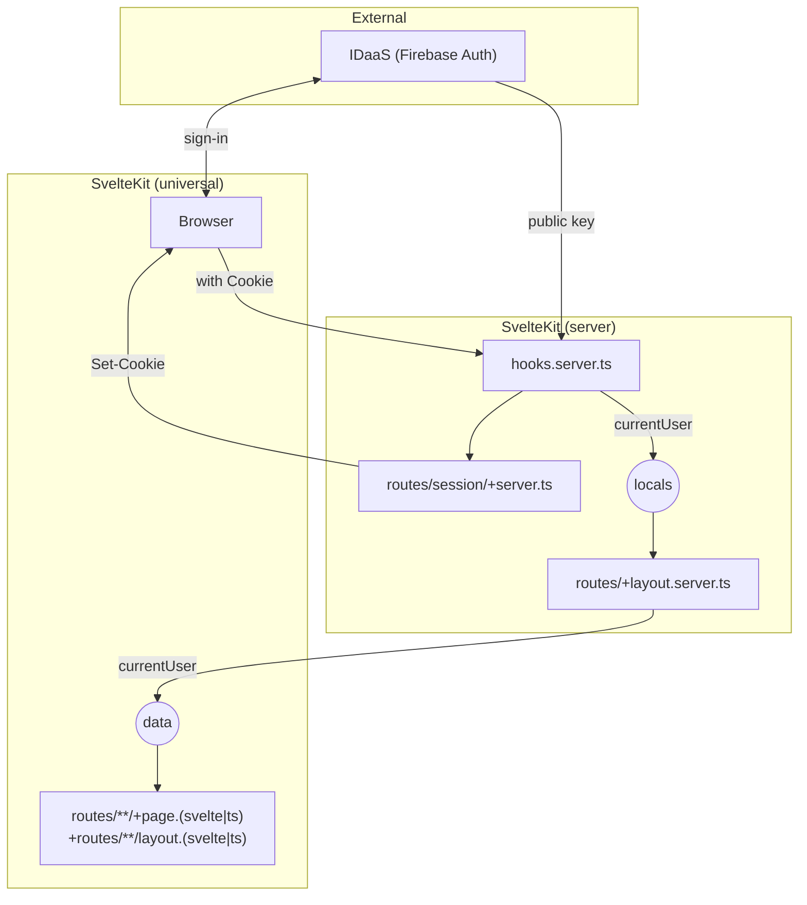

# sveltekit-firebaseauth-ssr-stripe

SvelteKit (Svelte 5, SSR) + Firebase Authentication の統合デモ。

## 実行方法

環境変数 `GOOGLE_SERVICE_ACCOUNT_KEY` で Firebase プロジェクトのサービスアカウントキーファイル (JSON) の中身を渡すこと。

```bash
cp .env.example .env

# 内容を編集

npm run dev
```

## 仕組み

Supabase公式のSvelteKit用SSRガイドなども参考にしつつ、よりシンプルにしている。



1. 認証ガードを `hooks.server.ts` で行うため、`hooks.server.ts` の時点で Cookie を検証しておく必要がある。得られたユーザ情報は `locals` で次に渡す。
   - （`locals` はサーバサイドコードでリクエストローカルなデータを受け渡すための場所）
2. `routes/+layout.server.ts` で、 `locals` のユーザ情報を `data` に変換する。
   - レイアウトの data はそのレイアウト配下のすべての `routes/**/+page.svelte`, `routes/**/+layout.svelte` で参照できる。
