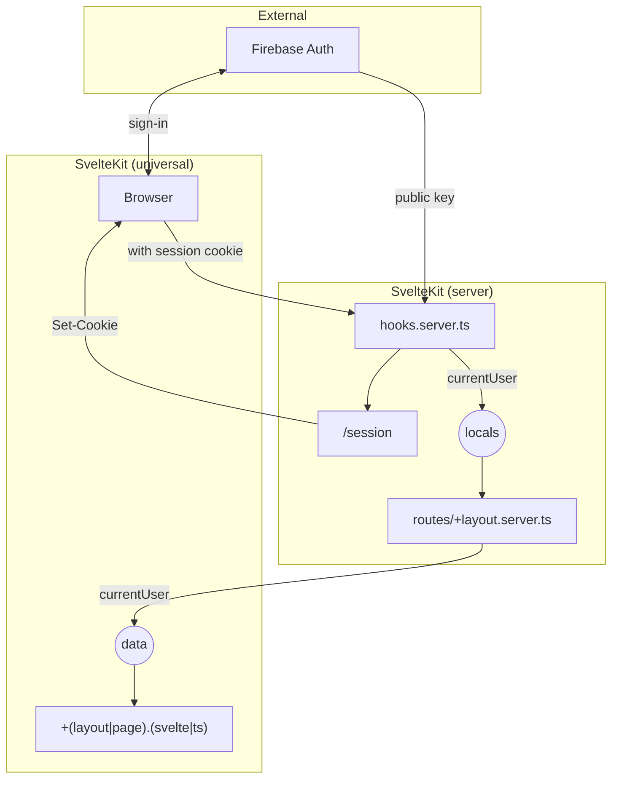

# @mierune/sveltekit-firebase-auth-ssr

## Usage

1. 必要なもの：

   - Firebase プロジェクトの Project ID
   - Firebase プロジェクトの API Key
   - Firebase の（Google Cloudの）サービスアカウントキー

2. `src/hooks.client.ts` に以下のようなコードを加える。

   TODO

3. `src/hooks.server.ts` に以下のようなコードを加える。

   TODO

4. `src/app.d.ts` に以下のようなコードを加える。

   TODO

5. `src/routes/+layout.server.ts` に以下のようなコードを加える。

   TODO

6. 適切な場所でサインインとサインアウトを実装する。

7. 必要な場所でユーザ情報を利用する。

## 概要図

